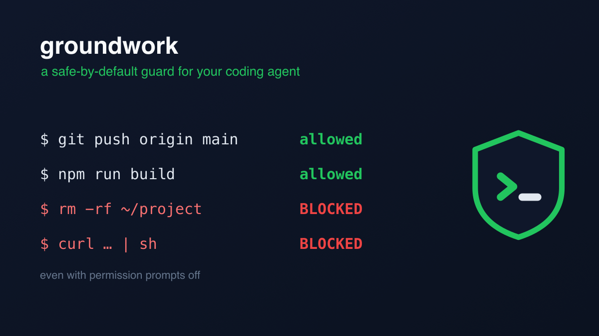
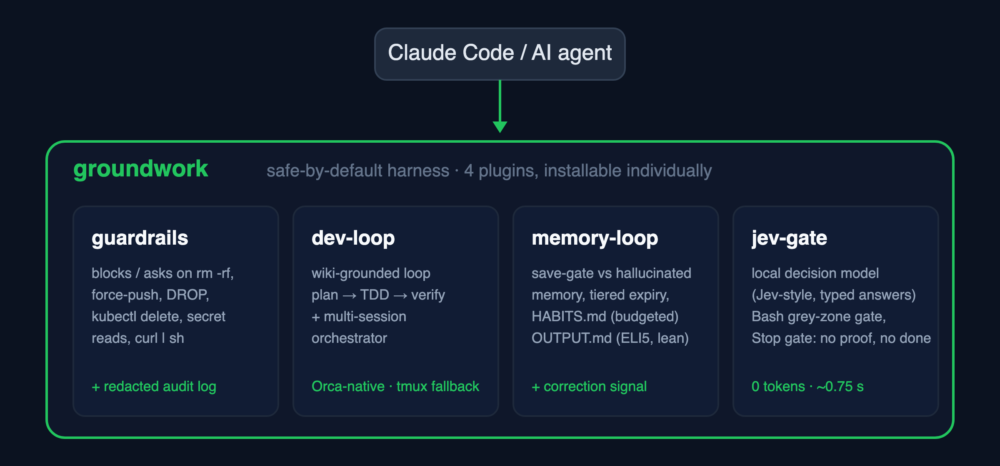

# groundwork

[English](README.md) | **한국어**

[](https://github.com/choiyounggi/groundwork/actions/workflows/test.yml)
[](LICENSE)

<p align="center">
  
</p>

**안전이 기본값인, 배터리 포함 Claude Code 하네스 — 스타터 팩.**

AI 코딩 에이전트에게 셸을 쥐여주면 *언젠가는* 반드시 `rm -rf`를 실행하거나,
인터넷의 스크립트를 그대로 `sh`에 파이프하거나, 히스토리 위로 force-push하거나,
테이블을 `DROP`하려 듭니다. `groundwork`는 가드레일**과** 좋은 습관을 설치
한 번으로 갖춰줍니다 — 에이전트는 빠르게, 그리고 안전하게 유지됩니다.
`--dangerously-skip-permissions`(yolo) 모드에서도 버팁니다: `deny`는 여전히
명령을 멈춥니다.

이 마켓플레이스는 네 개의 플러그인 — 안전, 품질 **그리고 오케스트레이션**,
지속성, 그리고 **판단** — 을 묶어 제공하며, 함께 설치해도 되고 골라 설치해도 됩니다:

<p align="center">
  
</p>

**한눈에 보기**

| 원하는 것 | 설치 | 한 줄 요약 |
|-----------|------|-----------|
| `curl \| sh`, `rm -rf`, force-push, `DROP` 앞에서 에이전트가 멈추길 | `guardrails` | yolo 모드에서도 버티는 로컬 Bash 가드 |
| 위키에 근거한 계획, 테스트 먼저, 병렬 워커 | `dev-loop` | 검증 루프 + **Orca 네이티브** 멀티 세션 오케스트레이터 |
| 저장 전에 확인되는 메모리, 몸에 남는 습관 | `memory-loop` | 메모리 라이프사이클 + **HABITS.md** + 군더더기 없는 **OUTPUT.md** |
| "완료"가 *증명된* 완료를 뜻하길, 토큰 0으로 | `jev-gate` | 판단만 하고 결정은 안 하는 로컬 **Jev 방식 판단 모델** |

| 플러그인 | 제공하는 것 |
|--------|-------------------|
| **guardrails** | 안전이 기본값인 Bash 가드 — 공급망 공격(`curl \| sh`), 디스크 파괴(`dd`/`mkfs`), 포크밤 명령은 **차단(block)** 하고, `rm -rf`, force-push, `DROP`/`TRUNCATE`, `kubectl delete`, 자격증명/`.env` 접근, 클라우드 자원 삭제, 시크릿 export 앞에서는 **확인(ask)** 합니다. 여기에 시크릿이 **마스킹된** 감사 로그까지. 모든 규칙은 설정 가능합니다. |
| **[dev-loop](https://github.com/choiyounggi/dev-loop)** | 위키에 근거한 구현 루프 **그리고 멀티 세션 오케스트레이터**. 루프는 **기계 판정 게이트가 붙은 3단계**(분석 → 설계 → 분해: 증거 기반 분석, 위키 라우팅된 결정을 fresh-context `plan-reviewer` 에이전트가 독립 리뷰)로 시맨틱 레이어 베스트프랙티스 위키에 대고 계획하고, 모든 태스크를 검증하며(TDD / PDCA / Reflexion), 실제로 배운 것으로 위키를 키워갑니다. 태스크 하나보다 큰 일이라면 `orchestrate`가 목표를 **의존 그래프**로 분해하고 각 태스크의 의존이 풀리는 순간 병렬 워커 세션을 스케줄합니다 — Orca가 설치돼 있으면 **Orca 네이티브**로(추적되는 Task/Dispatch, 이벤트 기반 `worker_done`/`ask`/`escalation` 메일, 네이티브 생존 감지), 없으면 순수 tmux로. 앞뒤로 사람의 승인 게이트 두 개가 붙습니다. |
| **memory-loop** | 에이전트를 위한 메모리 라이프사이클 — 환각 메모리를 막는 저장 게이트, 삭제 대신 보관하는 계층형 만료, 반복되는 실수를 즉시 감지하는 교정 시그널 훅, 그리고 선택적인 1회성 이름 설정(어시스턴트가 자기 이름을 직접 고를 수도 있습니다). 매 요청마다 로드되는 규칙 파일 두 개를 함께 배송합니다: 쓰는 시점에 **8000바이트 / 24개 예산**이 강제되는 습관 증류 프레임 **HABITS.md**, 그리고 ELI5처럼 쉽게·증거는 자르지 않게 쓰는 출력 스타일 **OUTPUT.md** — 모든 답변의 읽는 시간과 토큰을 줄입니다. |
| **[jev-gate](https://github.com/choiyounggi/jev-gate)** | [Jev](https://docs.typesafe.ai)(TypeSafe의 "System One" 모델 — 글 대신 타입이 정해진 선택지와 확률만 돌려줍니다) 방식의 로컬 **판단 모델** — ollaya · winnow:e4b, **토큰 0, 약 0.75초**, 결정자가 아닌 *보조자*로. 결정론 규칙을 먼저 두고 회색 지대만 모델에 묻는 Bash 게이트, 검증 증거 없는 "완료" 주장을 되돌리는 **정지 게이트**, 병렬 판단용 `decide` MCP 도구, 언제 모델에 넘길지 정한 스킬. 한국어 50건 측정: 위험 명령 놓침 0건, 에이전트 보고 분류 100%. |

## 설치

```text
/plugin marketplace add choiyounggi/groundwork
/plugin install guardrails@groundwork
/plugin install dev-loop@groundwork
/plugin install memory-loop@groundwork
/plugin install jev-gate@groundwork
```

가드만, 루프만, 메모리만, 판단만 — 또는 넷 다 설치하세요.

## 왜 그냥 스타터 템플릿이 아닌가?

대부분의 Claude Code 스타터는 *구조*를 스캐폴딩합니다. `groundwork`는
**행동**을 담아 배송합니다:

- **안전이 기본값** — 설치하는 순간 가드가 활성화됩니다. 설정 zero.
- **의견을 강요하지 않는 설정** — 모든 규칙이 `off` / `ask` / `block`, 레포별 또는 글로벌, 자신만의 패턴 추가 가능.
- **로컬 전용** — 명령 매칭은 당신의 머신에서 일어납니다. 클라우드 서비스로 아무것도 전송되지 않습니다.
- **증명됨** — 훅은 [`bats`](https://github.com/bats-core/bats-core) 테스트로 커버되고(`rm -rf`의 *언급*은 통과, *실행*은 잡힘) CI에서 돌아갑니다.

|                                            | CC 내장 권한 | 클라우드 가드레일 서비스 | **groundwork guardrails** |
|--------------------------------------------|:-----------------------:|:------------------------:|:-------------------------:|
| 셋업                                        | 세션마다 프롬프트       | API 키 + 클라우드 규칙   | 설치만, 설정 zero          |
| `--dangerously-skip-permissions`에서 동작    | 아니오¹                 | 제각각                   | **예** (검증됨)            |
| 패턴별 규칙 (`rm -rf` vs `DROP` vs `curl \| sh`) | 거칢                | 예                       | **예**                    |
| 레포에 커밋하는 팀 공유 설정                  | 제한적                  | 예 (클라우드)            | **예** (`.groundwork/`)   |
| 명령이 머신 밖으로 나감                      | 아니오                  | **예 — API로 전송**      | **아니오 — 완전 로컬**     |
| 시크릿 마스킹 감사 로그                      | 없음                    | 예 (클라우드)            | **예** (로컬)             |
| 테스트 / CI                                 | —                       | —                        | **예**                    |
| 비용                                        | 무료                    | 유료 티어                | 무료 · MIT                |

¹ 권한 프롬프트는 정확히 그 플래그가 꺼버리는 대상입니다. PreToolUse `deny`는 아닙니다 — FAQ 참고.

설치 직후 바로 확인해보세요 — `/guardrails:self-test`가 실제 위험 명령들을
가드에 통과시켜 각각의 block/ask 판정을 보여줍니다. **아무것도 실행하지 않고요.**

전체 규칙 목록과 설정은 [`plugins/guardrails/README.ko.md`](plugins/guardrails/README.ko.md)를 보세요.

## 오케스트레이션을 위해 만들어졌습니다 — Orca 네이티브, tmux 폴백

groundwork의 품질 루프는 세션 하나를 넘어 확장됩니다. dev-loop의
`orchestrate`는 **멀티 세션 오케스트레이터**입니다: 자연어 목표 하나를 의존
그래프로 분해하고, ready-set 스케줄러가 각 태스크의 의존이 승인되고 세션
슬롯이 비는 순간 그 태스크를 시작시킵니다 — 웨이브 배리어 없이. 모든 워커는
같은 위키 기반 검증 루프를 돌고(역할별 모델 선택: 워커는 저렴한 모델,
플래너/감사자는 강한 모델), 사람의 게이트 두 개(태스크 분할, 머지 전)가
자율 구간을 감쌉니다.

**Orca가 1급 기판입니다.** Orca CLI가 설치돼 있으면 코디네이터는 스폰*과
감독*을 모두 Orca 오케스트레이션으로 수행합니다: 모든 태스크 페이즈가 추적되는
Task + Dispatch가 되고, 코디네이터는 타이머 폴링 대신 푸시되는 `worker_done` /
`escalation` / `question` 메일에 블로킹합니다 — 워커의 질문이 몇 초 안에
도달합니다. 생존 감지는 두 가지를 묻습니다(터미널이 살아 있나? pane이 실제로
움직이나?) — 멈춘 워커를 기다리는 대신 잡아냅니다. Orca가 없어도 같은 런이
순수 tmux 위에서 강화된 감시 루프로 동작합니다: 워커의 질문 파일이
코디네이터를 깨우고, 조용해진 pane은 스톨로 표면화되며(분류 후 대응
플레이북), 화면에 뜬 선택 UI는 허용목록 키 이벤트로 응답합니다.

### guardrails 에스컬레이션 규약

사람이 보고 있을 때는 가드가 멈춰서 물어봐도 됩니다. 하지만 오케스트레이터가
띄운 헤드리스 워커 세션에서 `ask`는 **아무도 답할 수 없는 프롬프트**입니다 —
워커는 그냥 멈춰 버립니다.

guardrails는 이걸 환경변수 두 개로 해결합니다. 오케스트레이터 SDK 같은 건
필요 없습니다:

```bash
export GROUNDWORK_ESCALATION_DIR=/path/to/escalations
export GROUNDWORK_TASK_ID=my-task-1
```

이제 `ask`가 될 규칙은 해당 디렉토리에 **마스킹된** 에스컬레이션 레코드를 쓰고
`deny`를 반환합니다. 워커는 멈추는 대신 즉시 실패하고, 코디네이터는 어떤 태스크의
어떤 명령에서 어떤 규칙이 걸렸는지 정확히 보고 승인과 함께 그 단계를 재실행할 수
있습니다.

**dev-loop의 `orchestrate`가 이 배선을 대신 해줍니다.** `orchestrate`가 띄우는
모든 워커 세션은 — Orca가 `PATH`에서 감지되면 Orca 위에서, 아니면 순수 tmux로 —
두 변수를 export한 채 실행되고, 각 워커 워크트리는 자기만의 git-ignore된
`.groundwork/guardrails.json`을 받습니다: 샌드박스에서 무해한 규칙은 풀고
(일회용 워크트리 안에서는 `rm_rf: off`), 진짜 위험한 규칙은 `ask`로 남겨 에스컬레이션되게
하며(`curl_pipe_shell`, `worktree_escape`), `worktree_escape`에는
`allowPaths: [".orchestration"]`을 줘서 조율용 상태 쓰기는 허용하되 공유 메인
체크아웃을 오염시키는 쓰기는 그대로 걸리게 합니다. Orca에서는 코디네이터가 푸시된
에스컬레이션 메일에 블로킹하므로, 워커가 막힌 명령이 다음 폴링까지 기다리지 않고
몇 초 안에 전달됩니다.

이 규약은 일부러 단순합니다 — 디렉토리 하나와 변수 두 개 — 그래서 어떤
오케스트레이터든 채택할 수 있습니다. Orca는 이미 배선이 끝나 있는 쪽일 뿐입니다.

## 토큰은 예산입니다

에이전트가 매 요청마다 다시 읽는 파일은 매 요청마다 토큰을 씁니다. 한 문장을
더 쓰면 생성하는 시간과 읽는 시간이 늘어납니다. groundwork는 둘 다 예산으로
다룹니다:

- **OUTPUT.md** (memory-loop) — `~/.claude/CLAUDE.md`에 import되는 짧은 출력
  규칙: ELI5처럼 쉽게, 결론 먼저, 한 문장에 한 생각, 산문보다 불릿과 표, 과정
  서술과 인사말 금지. 답변·커밋 메시지·PR 본문·에이전트 브리프까지 에이전트가
  만드는 모든 토큰에 적용됩니다. 단 하나 자르지 않는 것은 증거입니다 — 테스트
  출력, 재현 명령, 에러 원문은 전문 그대로.
- **HABITS.md 예산** (memory-loop) — 항상 로드되는 습관 파일은 PreToolUse
  가드가 8000바이트 / 24개로 막습니다. 늘리는 쓰기는 거부되고 줄이는 쓰기는
  항상 허용되므로, 규칙 하나를 더하려면 합치거나 은퇴시켜야 합니다. 사례
  기록은 로드되지 *않는* `HABITS-CASES.md`에 둡니다.
- **토큰 0 판단** (jev-gate) — 분류·순위·예/아니오 게이트는 약 0.75초 만에
  확률이 붙은 타입 답을 돌려주는 로컬 판단 모델에 넘깁니다. 글은 한 글자도
  생성하지 않습니다. 글쓰기는 LLM이, 판단은 작은 모델이.
- **한 줄 세션 보고** (memory-loop 2.x) — SessionStart 훅은 각각 한 줄로
  보고하고, Stop 훅의 넛지는 없앴습니다.

## 생성 없는 판단 — Jev 패턴

판단 모델은 LLM이 못하는 일을 싸게 합니다: 상태와 타입이 정해진 질문 목록을
주면 *당신이 정한* 선택지 중 하나, 점수, 혹은 예/아니오 확률을 — 보정된 값으로,
병렬로, 산문 없이 — 돌려줍니다. jev-gate는 이 패턴을 하네스의 세 지점에
넣습니다:

| 지점 | 모델이 답하는 질문 | 누가 결정하나 |
|------|-------------------|--------------|
| **Bash 게이트** (PreToolUse) | 회색 지대의 이 명령이 위험한가? | 하드 거부 목록이 먼저, 읽기 전용 빠른 경로가 다음, 나머지만 모델. 모델은 하드 거부 목록을 절대 뒤집지 못합니다 |
| **정지 게이트** (Stop / SubagentStop) | 이 "완료" 메시지에 증거가 있는가? | 완료 주장 p ≥ 0.8이면서 증거 p ≤ 0.2면 이유와 함께 한 번 되돌립니다 |
| **`decide` MCP 도구** | 같은 기준의 판단 3건 이상 | 선택지 열거와 설계는 에이전트가, 순위는 모델이 |

서버가 없으면 전부 통과(fail-open)하고, 모든 판단이 로그에 남아 실제 데이터로
임계값을 다시 잡을 수 있습니다.

## 당신의 것으로 만들기

groundwork는 갇힌 정원이 아니라, 확장해서 쓰는 작고 정직한 코어입니다:

- **guardrails** — 모든 규칙이 `off` / `ask` / `block`이고, `.groundwork/guardrails.json`에
  자신만의 `extraAsk` / `extraBlock` 패턴을 추가해 팀과 커밋으로 공유합니다.
- **dev-loop** — `/dev-loop:configure`로 capability role을 *당신의* 도구에 매핑하세요:
  `verify`는 테스트/빌드 명령에, `knowledge`는 자체 위키나 knowledge MCP에,
  `explore`는 코드 검색에, `design`은 Figma에, `research`는 웹 검색 도구에(미설정 시 brave-search MCP → 내장 WebSearch 폴백). 번들된 베스트프랙티스 위키는
  `knowledge-flush` → 리뷰되는 PR을 통해 **배운 것으로부터 자랍니다**.
- **memory-loop** — 에이전트의 메모리와 습관은 직접 읽고 고칠 수 있는 평범한
  로컬 파일로 남습니다. 교정 시그널 주입 상한과 스윕 대상 디렉토리는
  `.groundwork/memory-loop.json`에서 조절하고, HABITS.md는 당신의 교정으로부터 키워가고,
  OUTPUT.md는 당신이 읽기 편한 방식으로 고치세요.
- **jev-gate** — `/jev-gate:setup`에서 기계에 맞는 모델을 고르고(8 GB 노트북부터
  24 GB 워크스테이션까지), `JEV_GATE_THRESHOLD` / `JEV_STOP_THRESHOLD`로 임계값을
  옮기거나, `JEV_GATE_URL`을 호스팅 Jev 엔드포인트로 바꾸세요.

당신의 위키, 당신의 테스트, 당신의 패턴을 가져오세요 — 하네스가 맞춰 적응합니다.

## FAQ

**"Claude Code가 이미 권한을 물어보는데 — 왜 이게 필요하죠?"**
내장 권한은 거칠고 세션 단위입니다: `Bash`를 한 번 승인하면 더는 묻지 않습니다.
guardrails는 *특정 위험 패턴*을 매번 게이트하고, 팀 공유 설정과 시크릿 마스킹
감사 로그가 있으며 — 권한 프롬프트를 **꺼버린** 상태에서도 동작합니다.

**"`settings.json` 권한으로 그냥 되지 않나요?"**
일부 도구를 deny할 수는 있지만, "`curl | sh`와 `dd`는 차단하고, `rm -rf`와
`DROP` 앞에서는 *물어보고*, 나머지는 전부 허용하되 시크릿은 마스킹해서 전부
로깅하라"는 표현할 수 없습니다. 그게 바로 이 가드입니다.

**"`--dangerously-skip-permissions`(yolo) 모드에서도 동작하나요?"**
예 — 검증했습니다. 권한 프롬프트를 건너뛰어도 PreToolUse `deny`는 여전히
명령을 멈춥니다. 파워 유저에게 안전망이 필요한 순간이 정확히 그때입니다.
[검증 기록](docs/launch/yolo-finding.md)을 보세요.

## 로드맵

groundwork는 `guardrails` + `dev-loop` + `memory-loop` + `jev-gate`를 배송합니다. 다음은
팀 거버넌스 — managed-settings 계층, policy-as-code, 감사 로그 집계 — 입니다.

## 라이선스

MIT — [LICENSE](LICENSE) 참고.
