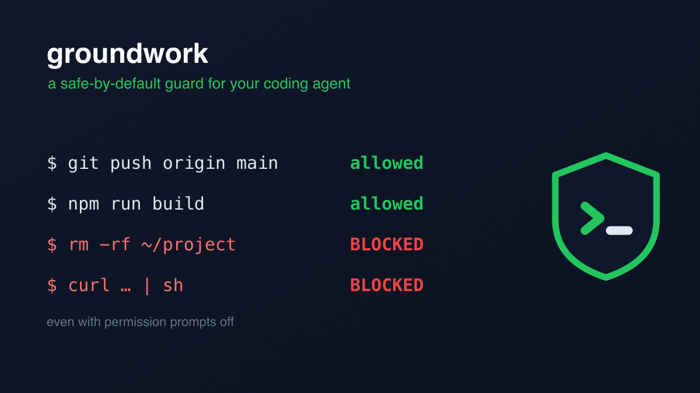
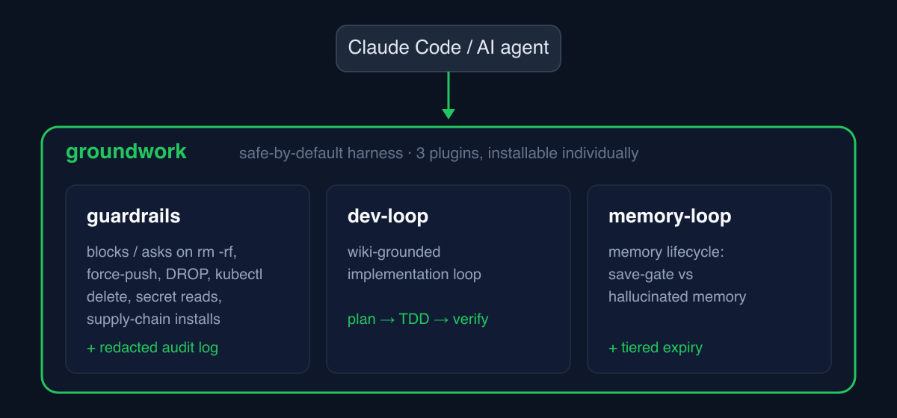

# groundwork

**English** | [한국어](README.ko.md)

[](https://github.com/choiyounggi/groundwork/actions/workflows/test.yml)
[](LICENSE)

<p align="center">
  
</p>

**A safe-by-default, batteries-included Claude Code harness — starter pack.**

Give an AI coding agent a shell and it *will*, eventually, try to run `rm -rf`,
pipe a script from the internet straight into `sh`, force-push over history, or
`DROP` a table. `groundwork` puts the guardrails **and** the good habits in place
in one install — so the agent stays fast, and stays safe. It even holds in
`--dangerously-skip-permissions` (yolo) mode: a `deny` still stops the command.

This marketplace bundles three plugins — safety, quality **and orchestration**,
continuity — you can install together or à la carte:

<p align="center">
  
</p>

| Plugin | What it gives you |
|--------|-------------------|
| **guardrails** | A safe-by-default Bash guard — **blocks** supply-chain (`curl \| sh`), disk-destroying (`dd`/`mkfs`), and fork-bomb commands; **asks** before `rm -rf`, force-push, `DROP`/`TRUNCATE`, `kubectl delete`, credential/`.env` access, cloud-resource deletion, and secret exports. Plus a **redacted** audit log. Every rule is configurable. |
| **[dev-loop](https://github.com/choiyounggi/dev-loop)** | A wiki-grounded implementation loop **and a multi-session orchestrator**. The loop plans through **three mechanically gated phases** (Analyze → Design → Decompose: evidence-backed analysis, wiki-routed decisions independently reviewed by a fresh-context `plan-reviewer` agent) against a semantic-layer best-practices wiki, verifies every task (TDD / PDCA / Reflexion), and grows the wiki from what you actually learn. Bigger than one task? `orchestrate` decomposes the goal into a **dependency graph** and schedules parallel worker sessions the moment their dependencies clear — **Orca-native** when Orca is installed (tracked Task/Dispatch provenance, event-driven `worker_done`/`ask`/`escalation` mail, native liveness), plain tmux otherwise — with two human gates around it. |
| **memory-loop** | A memory lifecycle for your agent — a save gate against hallucinated memories, tiered expiry with archive-not-delete, a periodic learning-review nudge, a habit-distillation frame (HABITS.md), and an optional one-time identity setup (the assistant can even pick its own name). |

## Install

```text
/plugin marketplace add choiyounggi/groundwork
/plugin install guardrails@groundwork
/plugin install dev-loop@groundwork
/plugin install memory-loop@groundwork
```

Install just the guard, just the loop, just the memory — or all three.

## Why not just a starter template?

Most Claude Code starters scaffold *structure*. `groundwork` ships **behavior**:

- **Safe by default** — the guard is active the moment you install it. Zero config required.
- **Configurable, not just opinionated** — every rule is `off` / `ask` / `block`, per-repo or global, plus your own patterns.
- **Local-only** — commands are matched on your machine. Nothing is sent to a cloud service.
- **Proven** — the hooks are covered by [`bats`](https://github.com/bats-core/bats-core) tests (a *mention* of `rm -rf` passes; an *execution* is caught) and run in CI.

|                                            | CC built-in permissions | Cloud guardrail services | **groundwork guardrails** |
|--------------------------------------------|:-----------------------:|:------------------------:|:-------------------------:|
| Setup                                      | per-session prompts     | API key + cloud rules    | install, zero config      |
| Works in `--dangerously-skip-permissions`  | no¹                     | varies                   | **yes** (verified)        |
| Per-pattern rules (`rm -rf` vs `DROP` vs `curl \| sh`) | coarse       | yes                      | **yes**                   |
| Team-shared config in the repo             | limited                 | yes (cloud)              | **yes** (`.groundwork/`)  |
| Commands leave your machine                | no                      | **yes — sent to API**    | **no — fully local**      |
| Audit log with secret redaction            | no                      | yes (cloud)              | **yes** (local)           |
| Tests / CI                                 | —                       | —                        | **yes**                   |
| Cost                                       | free                    | paid tiers               | free · MIT                |

¹ Permission prompts are exactly what that flag turns off. A PreToolUse `deny` is not — see the FAQ.

Try it right after install — `/guardrails:self-test` feeds real dangerous commands
through the guard and shows each block/ask decision, **without executing any of them.**

See [`plugins/guardrails/README.md`](plugins/guardrails/README.md) for the full rule list and configuration.

## Built for orchestration — Orca-native, tmux-fallback

groundwork's quality loop scales past one session. dev-loop's `orchestrate` is a
**multi-session orchestrator**: it decomposes one natural-language goal into a
dependency graph, and a ready-set scheduler starts each task the moment its
dependencies are approved and a session slot frees — no wave barriers. Every
worker runs the same wiki-grounded verification loop (with per-role model
selection: a cheap worker model, a strong planner/auditor), and two human gates
(task split, pre-merge) bracket the autonomy.

**Orca is the first-class substrate.** With the Orca CLI installed, the
coordinator drives spawn *and supervision* through Orca orchestration: every
task phase is a tracked Task + Dispatch, and the coordinator blocks on pushed
`worker_done` / `escalation` / `question` mail instead of polling on a timer —
a worker's blocking question reaches you in seconds. Liveness asks two
questions (is the terminal alive? is the pane actually moving?), so a wedged
worker is caught instead of waited out. Without Orca, the same run works on
plain tmux with a hardened watch loop: a worker's question file wakes the
coordinator, a silent pane surfaces as a stall with a classify-then-act
playbook, and an on-screen chooser is answered with allowlisted key events.

### The guardrails escalation contract

A guard that stops to ask is fine when a human is watching. In a headless worker
session spawned by an orchestrator, an `ask` is a prompt nobody can answer — the
worker just hangs.

guardrails solves that with a plain env-var contract, no orchestrator SDK:

```bash
export GROUNDWORK_ESCALATION_DIR=/path/to/escalations
export GROUNDWORK_TASK_ID=my-task-1
```

Any rule that would `ask` then writes a **redacted** escalation record to that
directory and returns `deny`. The worker fails fast instead of hanging, and the
coordinator sees exactly which rule fired, on which command, in which task — and
can re-issue the step with approval.

**dev-loop's `orchestrate` wires this up for you.** Every worker session it
spawns — on Orca when it is detected on your `PATH`, on plain tmux otherwise —
is launched with both variables exported, and each worker
worktree gets its own git-ignored `.groundwork/guardrails.json`: sandbox-harmless
rules loosened (`rm_rf: off` inside a throwaway worktree), genuinely dangerous
ones kept at `ask` so they escalate (`curl_pipe_shell`, `worktree_escape`), and
`worktree_escape` given `allowPaths: [".orchestration"]` so coordination state
writes are sanctioned while corrupting the shared main checkout still fires. On
Orca the coordinator blocks on pushed escalation mail, so a worker's blocked
command reaches you in seconds rather than at the next poll.

The contract is deliberately dumb — a directory and two variables — so any
orchestrator can adopt it. Orca is simply the one already wired up.

## Make it yours

groundwork is a small, honest core you extend — not a walled garden:

- **guardrails** — every rule is `off` / `ask` / `block`, and you add your own
  `extraAsk` / `extraBlock` patterns in `.groundwork/guardrails.json`, committed and
  shared with your team.
- **dev-loop** — map its capability roles to *your* tools with `/dev-loop:configure`:
  point `verify` at your test/build command, `knowledge` at your own wiki or knowledge
  MCP, `explore` at your code search, `design` at Figma, `research` at your web-search tool (falls back to brave-search MCP, then built-in WebSearch). The bundled best-practices wiki
  then **grows from what you learn** via `knowledge-flush` → reviewed PRs.
- **memory-loop** — your agent's memory and habits stay plain local files you can
  read and edit; tune the nudge cadence and swept directories in
  `.groundwork/memory-loop.json`, and grow HABITS.md from your own corrections.

Bring your own wiki, your own tests, your own patterns — the harness adapts.

## FAQ

**"Claude Code already asks for permission — why do I need this?"**
Built-in permissions are coarse and per-session: approve `Bash` once and it stops
asking. guardrails gates *specific dangerous patterns* every time, with team-shared
config and a redacted audit log — and it still works when you've turned permission
prompts **off**.

**"Can't I just do this with `settings.json` permissions?"**
You can deny some tools, but not express "block `curl | sh` and `dd`, *ask* before
`rm -rf` and `DROP`, allow everything else, and log it all with secrets redacted."
That is what the guard is.

**"Does it work in `--dangerously-skip-permissions` (yolo) mode?"**
Yes — verified. A PreToolUse `deny` still stops the command even when permission
prompts are skipped. That is exactly when a power user needs a net. See
[the finding](docs/launch/yolo-finding.md).

## Roadmap

groundwork ships `guardrails` + `dev-loop` + `memory-loop`. Team governance — a
managed-settings hierarchy, policy-as-code, and audit aggregation — is next.

## License

MIT — see [LICENSE](LICENSE).
